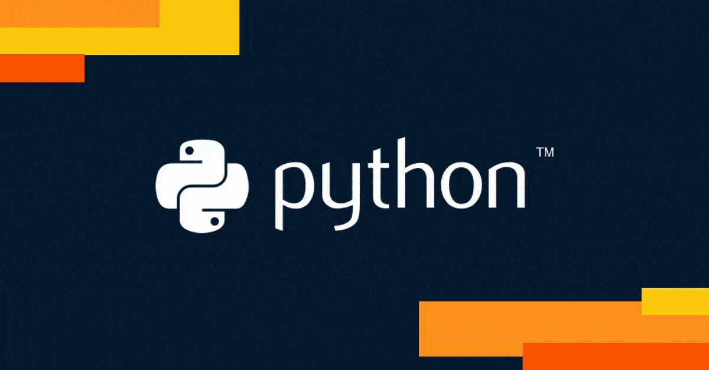

### 🚀 Bem-vindo ao meu GitHub!

### 🛠 Tecnologias que eu uso  
---

 
 
 

Olá! 👋 Sou um entusiasta de programação, especialmente com **Python**. Aqui você encontrará projetos, experimentos e aprendizados sobre desenvolvimento de software.  

### 🐍 Sobre mim 
----
💡 Apaixonado por tecnologia e resolução de problemas.  
📌 Compartilhando projetos com foco em **Python**, desde automação até análise de dados.  
🎯 Sempre em busca de novos desafios e aprendizados.  

### 📂 O que você encontrará aqui?  
🔹 Scripts úteis e soluções para problemas do dia a dia.  
🔹 Projetos usando **bibliotecas populares** como `pandas`, `flask`, `tkinter` e muito mais.  
🔹 Aplicações com **herança, geração de senhas e animações interativas**.  

### 📫 Entre em contato!  
💼 [LinkedIn](https://www.linkedin.com/in/kristoffersonbalionis)  
📧 [E-mail](mailto:kbalionis@yahoo.com.br)  

✨ **Sinta-se à vontade para explorar e contribuir!**  
